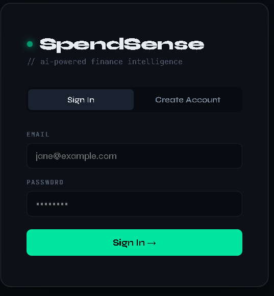

# 💰 SpendSense — AI Expense Tracker

An AI-assisted expense tracking system with intelligent categorization and real-time financial insights.

SpendSense is a full-stack AI-assisted expense tracking application that helps users manage and analyze their finances intelligently. It combines machine learning with interactive dashboards to provide automatic expense categorization and meaningful insights into spending habits.

---

## 🚀 Live Demo

🌐 **Frontend:** [SpendSense App](https://spendsense-xyz.netlify.app)  
🔗 **Backend API:** [API Endpoint](https://spendsense-backend-hinw.onrender.com)

The application is fully deployed and accessible through the live demo links above.

---

## 📸 Screenshots

### 🔐 Authentication Page


### 📊 Dashboard


### 🧾 Expenses Page


### 📈 Insights


---

## 🛠️ Tech Stack

### Frontend
- HTML  
- CSS  
- JavaScript  
- React (CDN)  
- Chart.js  

### Backend
- Python (Flask)  
- REST API architecture  
- JWT Authentication  

### Database
- PostgreSQL (Render — Production)  
- SQLite (Local Development)  

### Machine Learning
- Scikit-learn  
- TF-IDF Vectorizer  
- Naive Bayes Classifier  

---

## ✨ Features

- 🔐 User Authentication (Signup / Login)  
- 💰 Add, Edit, Delete Expenses  
- 🔎 Search & Filter Expenses  
- 🤖 AI-assisted Expense Categorization  
- 📊 Interactive Dashboard & Charts  
- 📈 Spending Insights & Analytics  
- ☁️ Fully Deployed (Frontend + Backend + Database)  

---
## 🔌 REST API Overview

All endpoints require the header:

```
Authorization: Bearer <token>
```

except authentication routes.

---

### 🔐 Authentication

| Method | Endpoint | Description |
|------|------|------|
| POST | `/api/auth/signup` | Register a new user |
| POST | `/api/auth/login` | Login and receive JWT token |

Example signup request:

```json
{
  "name": "Jane",
  "email": "jane@example.com",
  "password": "secret123"
}
```

Example login request:

```json
{
  "email": "jane@example.com",
  "password": "secret123"
}
```

Example response:

```json
{
  "token": "<jwt>",
  "user": {
    "id": 1,
    "name": "Jane",
    "email": "jane@example.com"
  }
}
```

---

### 💰 Expenses

| Method | Endpoint | Description |
|------|------|------|
| GET | `/api/expenses` | List all expenses |
| POST | `/api/expenses` | Add a new expense |
| PUT | `/api/expenses/<id>` | Update an expense |
| DELETE | `/api/expenses/<id>` | Delete an expense |
| POST | `/api/expenses/categorize` | Get AI category suggestion |
| GET | `/api/expenses/insights` | Spending insights and analytics |

Example expense request:

```json
{
  "title": "Lunch at Zomato",
  "amount": 350.00,
  "category": "",
  "date": "2024-01-15",
  "notes": "Team lunch"
}
```

Example insights response:

```json
{
  "total": 12500.00,
  "count": 45,
  "by_category": [
    {
      "category": "Food & Dining",
      "amount": 4200.00,
      "percent": 33.6
    }
  ],
  "monthly": [
    {
      "month": "2024-01",
      "amount": 6200.00
    }
  ]
}
```
---

## 🧠 AI Workflow

Expense Title → TF-IDF Vectorization → Naive Bayes Model → Category Prediction → Confidence Check

- If confidence ≥ 40% → ML prediction used
- If confidence < 40% → Rule-based fallback categorization


---

## ⚙️ Project Structure

```
spendsense/
│
├── backend/
│   ├── app.py                      # Flask application entry point
│   ├── requirements.txt            # Python dependencies
│   ├── expenses.db                 # SQLite database (auto-created on first run)
│   │
│   ├── models/
│   │   ├── __init__.py
│   │   └── models.py               # SQLAlchemy models (User, Expense)
│   │
│   ├── routes/
│   │   ├── __init__.py
│   │   ├── auth.py                 # Authentication APIs (signup, login)
│   │   └── expenses.py             # Expense CRUD operations & insights APIs
│   │
│   └── utils/
│       ├── categorizer.py          # Rule-based expense categorization logic
│       ├── train_model.py          # Script to train ML categorization model
│       └── model.pkl               # Trained machine learning model
│
├── frontend/
│   └── index.html                  # Single-page React interface (CDN-based)
│
├── screenshots/                    # UI screenshots for README
│   ├── auth.png
│   ├── dashboard.png
│   ├── expenses.png
│   └── insights.png
│
├── .gitignore                      # Ignored files (venv, cache, env files)
└── README.md                       # Project documentation
```

---

## 🔧 Setup Instructions (Local)

Follow these steps to run the project locally.

---

### 1️⃣ Clone the Repository

```bash
git clone https://github.com/kamalsharma001/spendsense.git
cd spendsense
```

---

### 2️⃣ Backend Setup

Navigate to the backend folder and create a virtual environment.

```bash
cd backend
python -m venv venv
```

Activate the virtual environment.

**Windows**

```bash
venv\Scripts\activate
```

**Mac / Linux**

```bash
source venv/bin/activate
```

Install dependencies and start the backend server.

```bash
pip install -r requirements.txt
python utils/train_model.py
python app.py
```

The backend will start at:

```
http://127.0.0.1:5000
```

---

### 3️⃣ Run the Frontend

Open a new terminal and run:

```bash
cd frontend
python -m http.server 3000
```

Then open your browser and go to:

```
http://localhost:3000
```

The application should now be running locally.

---

## 🚀 Deployment

- **Frontend:** Netlify  
- **Backend:** Render  
- **Database:** PostgreSQL (Render)  

---

## ⚠️ Limitations

- Free database has limited lifetime on free tier  
- Backend may experience cold start delay  
- ML model accuracy depends on training dataset  

---

## 🔮 Future Improvements

- 📱 Mobile application version  
- 🔔 Budget alerts & notifications  
- 📤 Export reports (PDF / Excel)  
- 🧠 Advanced ML categorization models  
- 👥 Multi-user financial analytics  

---

## 👨‍💻 Author

**Kamal Sharma**  
B.E. Computer Science Engineering (AI & ML)  
Chandigarh University  

📧 sharmakamal1210@gmail.com  
🌐 GitHub: [kamalsharma001](https://github.com/kamalsharma001)
---
